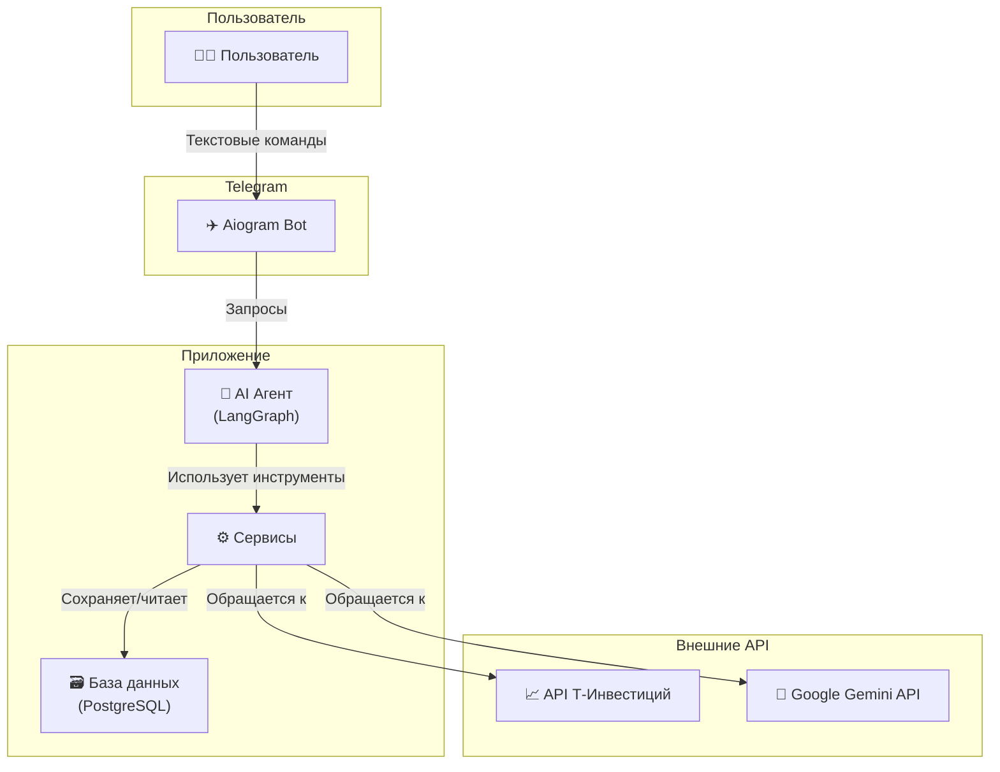

# Finance AI Helper Telegram Bot

[![Python Version][python-badge]][python-link]
[![Telegram Bot API][tg-badge]][tg-link]
[![Code style: black][black-badge]][black-link]
[![License: MIT][license-badge]][license-link]

Интеллектуальный Telegram-бот для управления личными финансами и мониторинга инвестиционного портфеля в Т-Инвестициях. Бот объединяет возможности официального API Т-Банка и мощь ИИ-агентов на базе LangGraph для глубокого анализа активов.

## 🚀 Ключевые возможности

*   **Гибкий импорт данных**:
    *   Подключение через API-токен Т-Инвестиций для получения актуальных данных о портфеле.
    *   Парсинг брокерских отчетов в формате Excel (`.xlsx`) для анализа исторических данных.
*   **Финансовый AI-Агент**: Полноценный чат-бот на базе **Google Gemini**, способный отвечать на вопросы о состоянии портфеля, анализировать новости и давать рекомендации.
*   **Анализ новостей**: Автоматический сбор и суммаризация новостей по интересующим активам.
*   **Асинхронная архитектура**: Полностью асинхронный код на базе `asyncio` и `aiogram` обеспечивает высокую производительность и отзывчивость.

## 🏛️ Архитектура

Проект построен на принципах слоистой архитектуры, что обеспечивает низкую связанность модулей и легкость масштабирования.



## 🛠️ Технологический стек

*   **Язык**: Python 3.13+
*   **Telegram Framework**: `aiogram 3.x`
*   **AI**: `langgraph`, `langchain`, `Google Gemini` / `LiteLLM`
*   **База данных**: `PostgreSQL` + `SQLAlchemy 2.0` (асинхронный драйвер `asyncpg`)
*   **Инвестиции**: `t-tech-investments` (SDK для T-Invest API)

## ⚙️ Установка и запуск

Выполните следующие шаги для локального развертывания проекта.

### 1. Предварительные требования

*   Python 3.13 или новее
*   Установленный и запущенный сервер PostgreSQL

### 2. Установка

```bash
# 1. Клонируйте репозиторий
git clone https://github.com/your_username/broker_agent.git
cd broker_agent

# 2. Создайте и активируйте виртуальное окружение
python -m venv .venv
# Для Windows:
# .venv\Scripts\activate
# Для macOS/Linux:
source .venv/bin/activate

# 3. Установите зависимости
pip install -r requirements.txt
```

### 3. Конфигурация

Проект использует файл `config.py` для хранения токенов и ключей API.

1.  Скопируйте файл-пример:
    ```bash
    cp app/core/config.py.example.txt app/core/config.py
    ```
2.  Откройте `app/core/config.py` и вставьте ваши реальные токены.

| Переменная       | Описание                                           |
| ---------------- | -------------------------------------------------- |
| `TELEGRAM_TOKEN` | Токен для вашего Telegram-бота.                    |
| `T_INVEST_TOKEN` | Токен для API Т-Инвестиций.                        |
| `GOOGLE_API_KEY` | API-ключ для Google Gemini.                        |
| `BASE_URL`       | URL для эндпоинта LiteLLM (если используется).     |
*Не забудьте также настроить подключение к базе данных в `app/database/session.py`.*

### 4. Запуск

После установки и конфигурации запустите бота:

```bash
python main.py
```

## 📁 Структура проекта

<details>
<summary>Нажмите, чтобы увидеть структуру</summary>

```text
broker_agent/
├── main.py              # Точка входа в приложение
├── requirements.txt     # Зависимости проекта 
├── app/                 # Основной пакет приложения
│   ├── agent/           # Логика AI-агента и графа LangGraph
│   ├── bot/             # Обработчики команд Telegram и FSM-состояния
│   ├── core/            # Конфигурация и глобальные настройки
│   ├── database/        # Модели таблиц, сессии и CRUD-запросы
│   ├── services/        # Бизнес-логика (API, расчеты, файлы)
│   └── utils/           # Вспомогательные утилиты
└── ...
```
</details>

[python-badge]: https://img.shields.io/badge/Python-3.13+-blue.svg
[python-link]: https://www.python.org/downloads/
[tg-badge]: https://img.shields.io/badge/Telegram-Aiogram%203.x-blue
[tg-link]: https://github.com/aiogram/aiogram
[black-badge]: https://img.shields.io/badge/code%20style-black-000000.svg
[black-link]: https://github.com/psf/black
[license-badge]: https://img.shields.io/badge/License-MIT-yellow.svg
[license-link]: https://opensource.org/licenses/MIT
```text